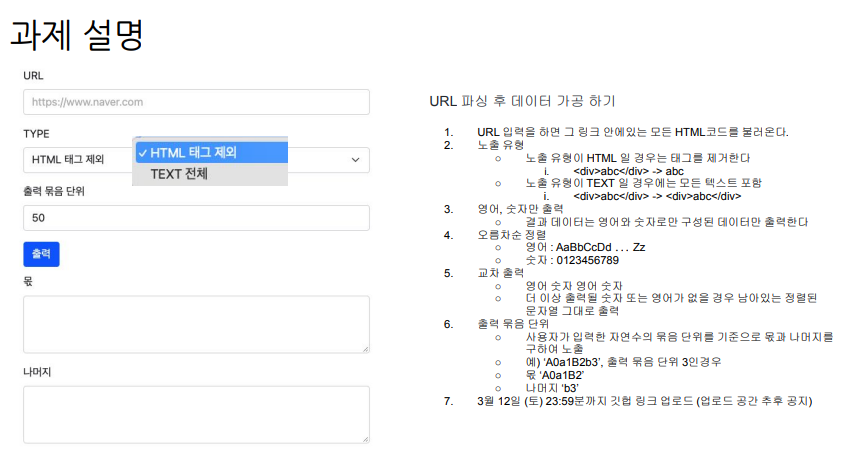
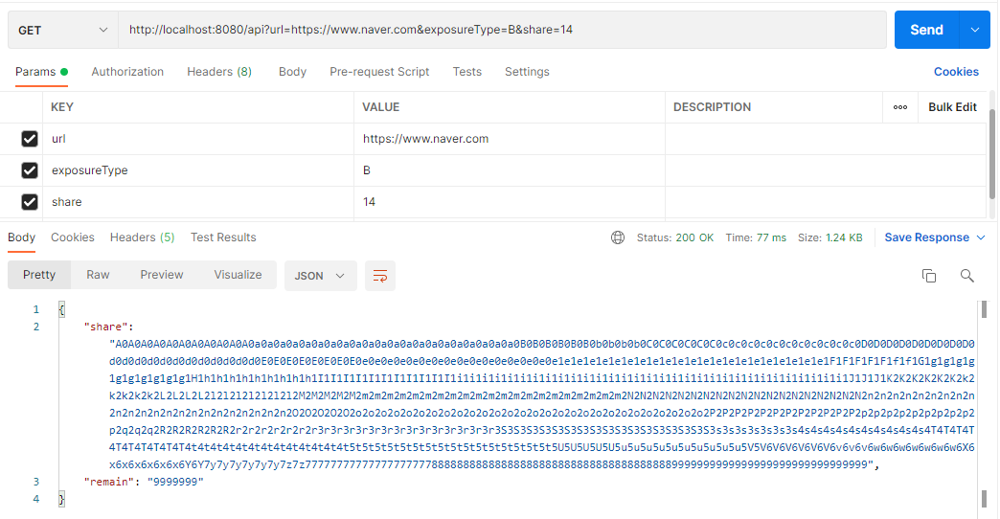
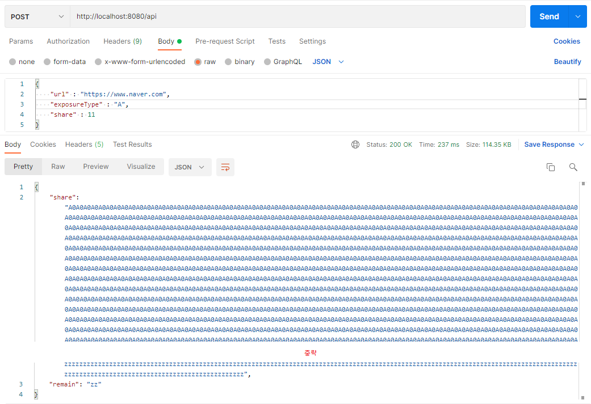
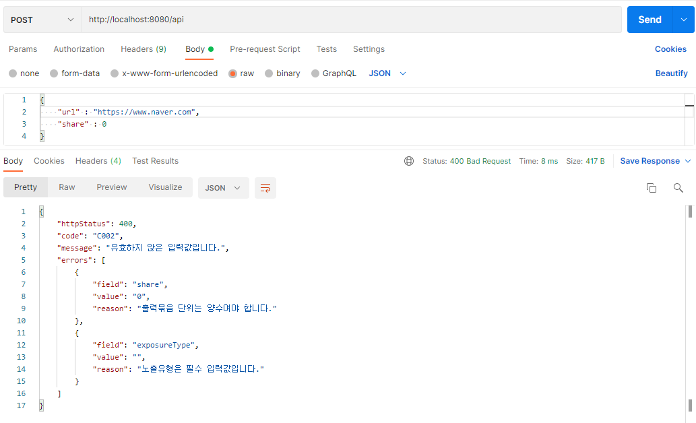
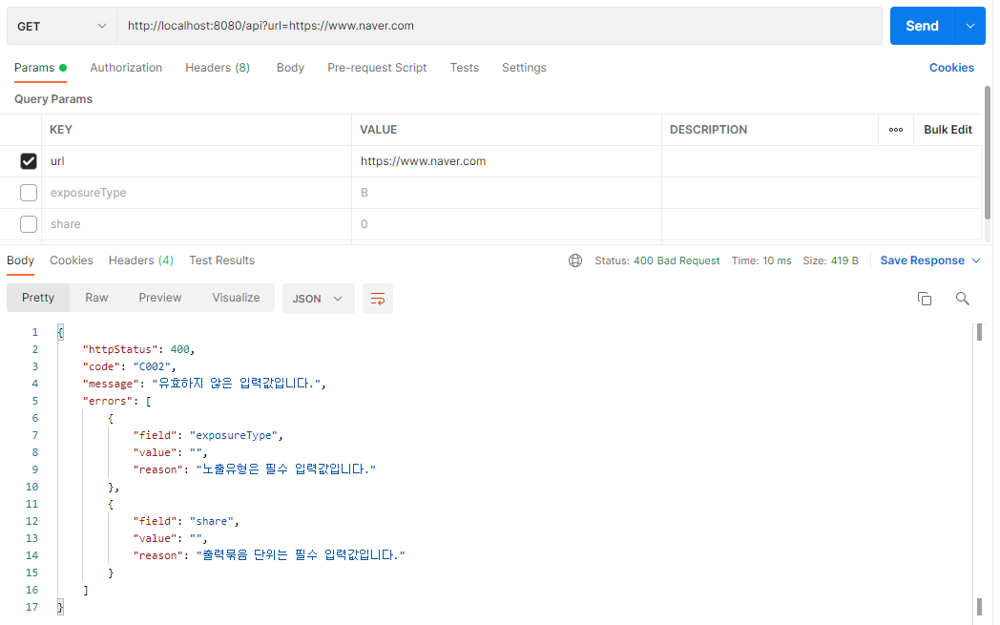

API 구현 과제
=====

## 목차
1. [과제](#과제)
2. [구현](#구현)
3. [상세](#상세)

### 과제
 

##### [목차로 이동](#목차)

### 구현
GET, POST 두 가지 API를 제공하며 유효하지 않은 데이터 입력 시 예외를 뱉어내도록 구현했다.

#### 유효한 경우
 

 

#### 유효하지 않은 경우
 

 

##### [목차로 이동](#목차)

### 상세
- [X] 스프링 부트 환경 개발 권장
- [X] 입력 데이터 유효성 검사 후 예외처리 구현
- [X] 노출 유형의 유연한 관리 위해 Enum 사용
	- 노출 유형 추가 시 Enum만 변경하면 되므로 OCP 준수
- [ ] Swagger 적용
- [ ] 테스트코드 작성

요구사항 외 고민한 사항은 아래와 같다(미구현 사항 포함).

- [X] 객체 지향적인 코드 작성을 위해 해당 클래스에서 관련 변수를 책임지도록 작성
	- 컨트롤러에서 Getter를 통해 값을 호출하지 않고 RequestVo로 값을 넘겨 조작
	- 부득이한 경우를 제외하고 Getter를 작성하지 않는 방향으로 고민
- [X] 메소드에 넘겨주는 파람의 경우 변경 가능성이 없다면 final 키워드 붙임으로서 의도 노출
	- 컨트롤러 메소드, 모델 메소드의 인자에 final 키워드 작성
- [X] 의도를 명확히 알고 쓰기 위해 Lombok 등 의존성 미추가
- [ ] 로거 적용
- [ ] 입력 화면 작성

##### [목차로 이동](#목차)